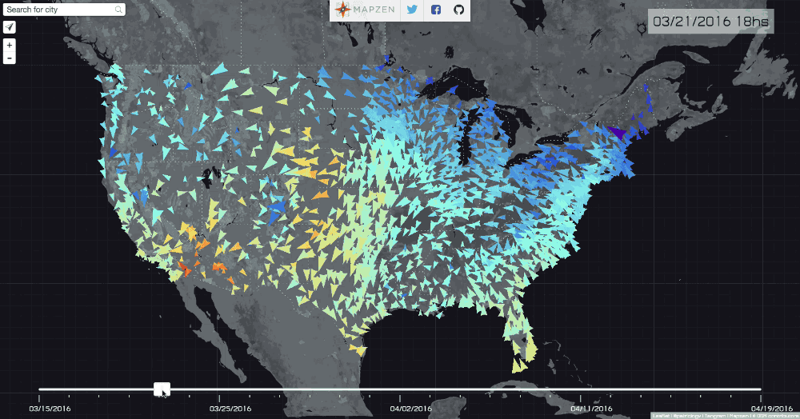
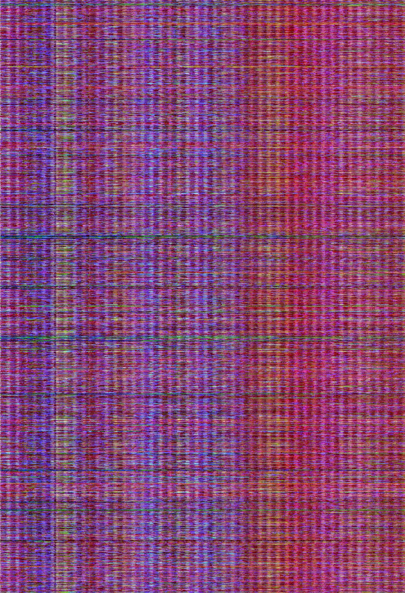

## Visualizing Weather over time with Tangram.js

This [Tangram JS](https://github.com/tangrams/tangram) example is the continuation of [this other tutorial about 3er party APIs](https://github.com/tangrams/WeatherNow). This time instead of getting the data from a 3er party API, we are gathering the data from [US NOAA's Weather Stations](http://weather.noaa.gov/pub/data/observations/metar/cycles) using a [python script](https://github.com/tangrams/WeatherOverTime/blob/gh-pages/data/getToday.py) on a [RaspberryPi](https://www.raspberrypi.org/), enconding this big data sent into an image to then display and animate using shaders inside [Tangram JS](https://github.com/tangrams/tangram).

### How it works?


Each day of the last 2 months [this script](https://github.com/tangrams/WeatherOverTime/blob/gh-pages/data/getToday.py) running in the [RaspberryPi](https://www.raspberrypi.org/) gathers the last 24hs of data.

```bash
python data/getToday.py
```

Then [progressively builds add an image](https://github.com/tangrams/WeatherOverTime/blob/gh-pages/data/parseAll.py) containing all the information of the last two months. For it, the temperature, wind speed and wind direction of each US NOAA station is encoded in to a single pixel. 

```bash
python data/parseAll.py
```

The RED channel will contain the temperature for each hour, the GREEN the wind speed and BLUE the wind rotation.

```python
def getColorFor(data, hour, station):
    if data[station].has_key(hour):
        datum = data[station][hour]
        return (int(toFahrenheit(datum['temp'])*2.55), int(datum['wind_speed']*5), int((datum['wind_deg']/360)*255), 255)
    else:
        return None
```

Each station will have row in the finnal image, while each column will be a single sample per hour of the last two months.



Looking closelly to the previus image, the amount of red conform we move in time (X axist) vary between day and night forming bumps or waves. Also we can differenciate redish clusters of columns (hot weeks) from greenish once (cooler weeks). In pararllel we can see that specific stations (more constant blur or green rows) that are located on cold places where the temperature is constantly low. 

The presence of wind will make more green or yellow pixels. We can see that they seams to come an go with some coherence.

### Why encoding data into images?

By encoding big data bases in images allows you to compress more than 300Mb of data into a single image of arround 3Mb. Also in this format, data can be upload to the graphic card unit (GPU) in a single call of the the WebGL/OpenGL driver.  Once it is in the GPU memory, the data can be retreve, process and animated at high speed.

### Loading this data to Tangram JS

Once the data is encoded into the image can be loaded to Tangram map through the [```scene.yaml```](https://github.com/tangrams/WeatherOverTime/blob/gh-pages/scene.yaml#L21-L24) file:

```yaml
...
textures:
    data_image:
        url: data/data.png
        filtering: nearest
...
```

Together with a [GeoJSON file containing the position of each station](https://github.com/tangrams/WeatherOverTime/blob/gh-pages/scene.yaml#L15-L17) as a POIs:

```YAML
sources:
    ...
    stations:
        type: GeoJSON
        url:   data/stations.geojson
```

We filter this POIs into a ```layer``` to be render with a custom ```style```. We also assing a specific color to each point depending in the ```id``` of the feature.

```YAML
layers:
    ...
    station:
        data: { source: stations }            
        draw:
            wind:
                interactive: true
                collide: false
                blend: overlay
                blend_order: 1
                size: 50
                color: |
                    function() {
                        var hovered = feature.id === global.hovered ? 1 : 0;
                        return [ ( Math.floor(feature.id/255))/255, (feature.id%255)/255, hovered ]; 
                    }
        ...
```

As you can see in the last lines, each ```feature.id``` is encoded into the geometry color of each point, together with a flag that checks if the station have been selected or not (BLUE channel).

The custom style for each station point, will be rendered with the following code that draws an arrow. Te arrow is rotated, scale and colored according the wind direction, wind speed and temperature.

```YAML
styles:
    ...
    wind:
        base: points
        texcoords: true
        animated: true
        mix: [functions-aastep, geometry-matrices, shapes-cross]
        shaders:
            defines:
                TWO_PI: 6.283185307
                PI: 3.1415926535897932384626433832795
                HALF_PI: 1.5707963267948966192313216916398
            uniforms:
                u_data: data_image
                u_scale: scale_image
                u_param: [812, 1599]
                u_offset: 0
            blocks: 
                global: |
                    float getIndex (vec2 encodedIndex) {
                        return (encodedIndex.x*65025.+encodedIndex.y*255.)+.5;
                    }
                    
                    float shape(vec2 st, int N){
                        st = st *2.-1.;
                        float a = atan(st.x,st.y)+PI;
                        float r = TWO_PI/float(N);
                        return cos(floor(.5+a/r)*r-a)*length(st);
                    }

                    vec4 getColor (vec2 st) {
                        float texWidth = u_param.x;
                        float texHeigth = u_param.y;
                        st.y = 1.-st.y/texHeigth;
                        return texture2D(u_data,vec2(st.x/texWidth,st.y));
                    }
                color: |
                    float index = getIndex(color.st);
                    float t = u_offset;
                    // t += fract(u_time);
                    
                    color = vec4(0.);
                    float i_now = floor(t);
                    float f_now = fract(t);
                    float next = i_now+1.;
                    vec4 data_now = getColor(vec2(mod(i_now,u_resolution.x),index));
                    vec4 data_next = getColor(vec2(mod(next,u_resolution.x),index));
                    vec4 data_interpol = mix(data_now,data_next,f_now);
                    float dir_now = data_now.b;
                    float dir_next = (data_next.g == 0.)? data_now.b : data_next.b;
                    float dir_delta = fract(dir_next-dir_now);
                    if (dir_delta > .5) {
                        dir_delta -= 1.;
                    }
                    dir_next = dir_now + dir_delta;
                    float w_deg = mix(dir_now, dir_next, f_now)*-TWO_PI;
                    float w_speed = data_interpol.g;
                    float temp = data_interpol.r;
                    
                    vec2 st = v_texcoord.xy;
                    float valid = smoothstep(0.5,1.,data_interpol.a);
                    
                    // Arrow
                    float scale = .5;
                    vec2 arrow_st = .5 + (rotate2D(w_deg) * (st - .5));
                    arrow_st *= vec2(scale+.5,.5);
                    float d = shape(arrow_st + vec2(scale*-.5+.25,.3),3) / shape(arrow_st + vec2(scale*-.5+.25,1.132),3);
                    color = texture2D(u_scale,vec2(1.-temp,.5));
                    color.a *= w_speed;
                    color.a = 1.0-step(.1+.15*w_speed,d);
                    // Hovered Arrow
                    color.a -= (1.-step(.05+.05*w_speed,d))*v_color.b;
                    color += max(rect(st,2.)-rect(st,1.6)-cross(st,5.,5.),0.)*v_color.b;
```

Altough it's a lot going on in this style. Is important to see how the data is fetch and decode from the texture. To locate the right pixel use the function ```getIndex()``` to retrieve the right row (Y axist) where the data that particular station is located together with the ```u_offset``` uniform that contain the time offset (X axis).

```glsl
    float index = getIndex(color.st);
    float t = u_offset;
```

Once it have the right positon of the pixel it gets their interpolated data using ```getColor()``` and decode their values. 

```glsl
    float w_deg = mix(dir_now, dir_next, f_now)*-TWO_PI;
    float w_speed = data_interpol.g;
    float temp = data_interpol.r;
```

**Note**: to correctly interpolate the wind direction, need to make some extra calculations, to smootly rotate in the shorter direction of the target direction.

Once all the data is ready to be display use the wind direction to rotate the coordenates on the fragment shader, and the wind speed to scale the shape in and out.

```glsl
    // Arrow
    float scale = .5;
    vec2 arrow_st = .5 + (rotate2D(w_deg) * (st - .5));
    arrow_st *= vec2(scale+.5,.5);
    float d = shape(arrow_st + vec2(scale*-.5+.25,.3),3) / shape(arrow_st + vec2(scale*-.5+.25,1.132),3);
    color = texture2D(u_scale,vec2(1.-temp,.5));
    color.a *= w_speed;
    color.a = 1.0-step(.1+.15*w_speed,d);
    // Hovered Arrow
    color.a -= (1.-step(.05+.05*w_speed,d))*v_color.b;
    color += max(rect(st,2.)-rect(st,1.6)-cross(st,5.,5.),0.)*v_color.b;
```

Not how it use [an extra image with a color gradient ](https://github.com/tangrams/WeatherOverTime/blob/gh-pages/scene.yaml#L25-L26) to "tint" the arrow with a color that express the temperature.


